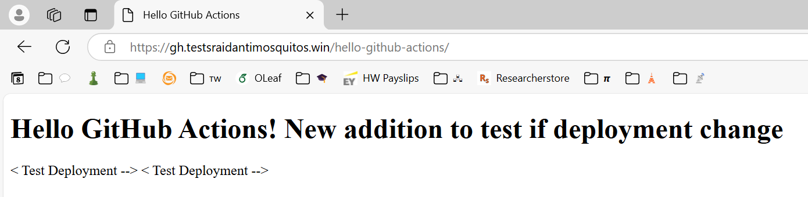

# Basic DNS Setup

The goal of this project is to learn and practice the basics of DNS. This is my implementation of [roadmap.sh](https://roadmap.sh/projects/basic-dns) project.

## Table of contents
1. [Requirements](#requirements)
2. [Custom Domain for GitHub Pages](#custom-domain-for-github-pages)
3. [Custom Domain for DigitalOcean Droplet](#custom-domain-for-digitalocean-droplet)
4. [Links to static websites](#links-to-static-websites)
5. [Brief concepts about DNS](#brief-concepts-about-dns)

--------------------------------------------------------
--------------------------------------------------------

## Requirements
This project assumes that you already completed the previous two projects: [GitHub Pages Deployment](../gh-deployment-workflow) and [Static Site Server](../static-site-server).

If that is not the case please complete those earlier. It is also a requirement to have a domain name, you can purchase one in Cloudflare, GoDaddy, Namecheap, etc. This tutorial will guide you through the steps to configure in Cloudflare, but GUI are considerably similar so you should be able to follow if using a different domain provider.

-------------------------------------------------------
-------------------------------------------------------

## Custom Domain for GitHub Pages
### **Step 1**: Add your domain to GitHub pages
1. Go to your GitHub repository.
2. Navigate to **Settings** > **Pages**. 
3. In the **Custom domain** section, enter your domain (e.g. `yourdomainname.com`). 
4. **Save changes** and wait for GitHub to detect your DNS settings. If you just freshly purchased your domain and did not configure any DNS registers, this will most likely fail. DNS register configuration is explained in the next steps.
5. **Keep this tab open** while you configure Cloudflare.

### **Step 2**: Configure Cloudflare DNS records.
1. Log in to [Cloudflare](https://dash.cloudflare.com/).
2. Click on your **domain name** to access its settings. 
3. Navigate to the "**DNS**" tab on the left sidebar. 
4. Add A records (for root domain `yourdomainname.com`). Steps:
    - Click "**Add record**". 
    - Set **Type** to `A`.
    - In **Name**, enter `@` (this represents your root domain).
    - In **IPv4 Address**, enter `185.199.108.153`.
    - **Proxy Status**: set to "**DNS Only**" (:warning:**NOT Proxied**).
    - Click on "**Save**".
    - Repeat this process for the other three IP addresses in the following table, which represents GitHub server's IP addresses that host your static site. These are the official GitHub Pages IPs.

| Type  | Name  | IPv4 Address       |
|-------|-------|--------------------|
| A     | @     | `185.199.108.153`  |
| A     | @     | `185.199.109.153`  |
| A     | @     | `185.199.110.153`  |
| A     | @     | `185.199.111.153`  |

5. Add CNAME record (for `yourdomainname.com`). Steps:
    - Click "**Add record**".
    - Set **Type** to `CNAME`.
    - In **Name**, enter `www`.
    - In **Target**, enter `your-username.github.io` (replace `your-username` with your actual GitHub username)
    - **Proxy Status**: set to "**DNS Only**" (:warning:**NOT Proxied**).
    - Click "**Save**".

| Type  | Name  | Target (Value)             |
|-------|-------|----------------------------|
| CNAME | www   | `your-username.github.io`  |


### Step 3: Disable Cloudflare Proxy (IMPORTANT)
- Cloudflare **must NOT proxy traffic for GitHub Pages, or SSL will break**.
- Make sure all **Proxy status** values are set to "**DNS Only**" (:warning:**NOT Proxied**).
- If a record is proxied, click on the orange cloud icon :cloud: **until it turns grey**.


### Step 4: Verify DNS setup
- Open [dnschecker.org](https://dnschecker.org/).
- Enter your domain (e.g. `yourdomainname.com`).
- Check if **A records** and **CNAME records** are showing up correctly.
- If not, **wait up to 24 hours** for *[DNS Propagation](#what-is-dns-propagation)*.


### Step 5: Re-enable GitHub Pages HTTPS
1. Go back to **GitHub Settings** > **Pages**.
2. **Enable "Enforce HTTPS"** (it may take a few seconds to activate).
3. **GitHub will issue a SSL certificate** automatically.


-------------------------------------------------
-------------------------------------------------

## Custom Domain for DigitalOcean Droplet
Now, I want the domain name to point at the DigitalOcean Droplet that I created to serve a static website as well in this [project](../static-site-server).

To do that, DNS records must be changed to point at the DigitalOcean Droplet public IP address.

### Step 1: Get your DigitalOcean Droplet IP address.
- You can find the IP address by ssh-ing into the Droplet (`ssh alias-server`), you should've it configured if you followed this [project](../ssh-remote-server-setup).
- Once in the server terminal run `hostname -I` and you should obtain the server's public IP (usually the first address output).
- This will replace the GitHub Pages' IPs in the Cloudflare DNS settings.

### Step 2: Update your DNS A-Type Records in Cloudflare.
1. Go to [Cloudflare Dashboard](https://dash.cloudflare.com/).
2. Click on the domain name.
3. Navigate to DNS settings.
4. Delete your current A-type records pointing to GitHub Pages:
    - `185.199.108.153`
    - `185.199.109.153`
    - `185.199.110.153`
    - `185.199.111.153`
5. Add a new A-type record:
    - **Type**: `A`
    - **Name**: `@`
    - **Value (IP address)**: *Your Cloudflare Droplet's IP (e.g., `192.168.1.100`)*
    - **Proxy Status**: Set to be "Proxied" (Orange Cloud :cloud:) to use [Cloudflare's CDN](#what-role-does-the-content-delivery-network-cdn-play-as-a-proxy-in-cloudflare-dns) and security features.

### Step 3: Configure DNS CNAME-type records in Cloudflare
This is only required if you want to use `www.yourdomainname.com` (not only `yourdomainname.com`).
1. In Cloudflare modify the GitHub Pages' CNAME-type records to point to the DigitalOcean Droplet.
    - Type: `CNAME`
    - Name: `www`
    - Value: `yourdomainname.com`
    - Proxy Status: `Proxied` (Orange cloud :cloud:).

### Step 4: Remove the custom domain from GitHub Pages
1. Go to the GitHub repository, **Settings** &rarr; **Pages**.
2. Delete the custom domain (`yourdomainname.com`).
3. Disable GitHub Pages (if you do not longer need it).

> [!tldr] What happens after this changes?
> The domain (`yourdomainname.com`) will now point to the DigitalOcean Droplet instead of GitHub Pages.
> GitHub Pages will no longer serve the website (unless using a different subdomain for it).
> Cloudflare will route traffic through its CDN, offering caching, security, and performance improvements.

----------------------------------------------------

### ALTERNATIVE: Use a subdomain for GitHub pages
To still use GitHub Pages to serve the static website, we can host it in a subdomain. For example:
- **Main website** (`yourdomainname.com`) &rarr; Hosted on DigitalOcean Droplet.
- **Subdomain** (`gh.yourdomainname.com`) &rarr; Hosted on GitHub Pages.

#### Steps to setup a subdomain in Cloudflare
1. In Cloudflare, add a new DNS record:
    - Type: `CNAME`
    - Name: `gh`
    - Value: `your-username.github.io`
    - Proxy Status: `DNS Only` (Gray cloud :cloud:).
2. In GitHub Pages settings, change the custom domain to `gh.yourdomainname.com`


#### Update GitHub Actions `deploy.yml` script to automatically link the static website hosted in GitHub Pages to the domain name.

To further enhance CI/CD workflow, it is convenient to update the `deploy.yml` script (stored in `.github/workflows/`) presented in the [GitHub Pages Deployment Workflow](../gh-deployment-workflow) project. The CNAME file job must be added, between the static website directory creation and the downloading of the artifact.
```yaml
# ...
jobs:
  deploy:
  runs-on: ubuntu-latest
  steps:
    # ...

    - name: Clear site files and re-create directory
      run: |
        DIR="hello-github-actions"
        git rm -rf $DIR
        mkdir -p "$DIR"

    - name: Add CNAME file (if it does not exist)
      run: |
        FILENAME="CNAME"
        if [ ! -d "$FILENAME" ]; then
          echo "gh.yourdomainname.com" > FILENAME

    - name: Download artifact
      uses: actions/download-artifact@v4
      with:
        name: hello-github-actions
        path: hello-github-actions

    # ...
```
This will ensure that the domain name linked to the static website hosted by GitHub Pages servers remains configured in every new push of changes.

## Links to static websites
Please find both static websites in the following links:
| Server                | Link  |
|-----------------------|-------|
| GitHub Pages          | [gh.testsraidantimosquitos.win/hello-github-actions](https://gh.testsraidantimosquitos.win/hello-github-actions)  |
| DigitalOcean Droplet  | [testsraidatimosquitos.win](https://testsraidantimosquitos.win) or [www.testsraidantimosquitos.win](https://www.testsraidantimosquitos.win)  |

Screenshots of the website content:



## Brief concepts about DNS
The **Domain Name System (DNS)** is like the **phonebook of the internet** —it translates human-readable domain names (e.g., `yourdomainname.com`) into machine-readable IP addresses (e.g., `185.199.108.153` for GitHub Pages).

### How does DNS work? (summary of [this comic](https://howdns.works/))

> [!tldr] Too Long Didn't Read
> 1. **User types** `yourdomainname.com` in the browser.
> 2. **Browser asks a DNS resolver** for the IP address.
> 3. **Cloudflare's DNS responds** with GitHub Pages' IP (`185.199.x.x`).
> 4. **Browser connects to GitHub Pages**, which loads the website

Let's say a user visits `https://yourdomainname.com`in their browser, here is what happens:

#### :one: The browser requests the IP address
- The browser needs an **IP address** to load the website corresponding to the requested domain, so it sends a **DNS query** to your computer.
- The computer will check for **cached IP addresses** mapped to the domain name in several locations:
    - Browser cache.
    - OS cache.

#### :two: The recursive DNS resolver finds the IP
- If there is **no cached IP address** assigned to `yourdomainname.com`, it asks a **recursive DNS resolver** (like Google `8.8.8.8`, Cloudflare `1.1.1.1` or sometimes provided by your ISP).
- The resolver checks **multiple DNS servers** to find the correct IP address mapped to that domain name.

#### :three: DNS Resolver Queries Authoritative DNS Servers
- It starts by asking **root DNS servers**.
- Root servers direct it to the **TLD (Top-Level Domain) server** (e.g., `.com` servers for `.com` domains).
- The TLD server directs it to the **Authoritative DNS server** for `yourdomainname.com` (like Cloudflare).

#### :four: Cloudflare's DNS Server Responds
- Since I have set up Cloudflare's DNS, this is my DNS host. Cloudflare's DNS servers check the **A records** and **CNAME records** we set up earlier:
    - **A records** &rarr; Map `yourdomainname.com` to **GitHub pages IPs** (`185.199.108.153`, etc.").
    - **CNAME record** &rarr; Maps `www.yourdomainname.com` to `raidantimosquitos.github.io`.
- The DNS resolver gets the correct IP address from Cloudflare's DNS.

#### :five: Browser connects to GitHub pages
- The DNS resolver sends back the received IP address to the browser. The browser now knows the **IP address**.
- The browser connects to **GitHub Pages servers (185.199.X.X)** and requests the website content.
- GitHub Pages **serves the static website** to the user.

#### Key takeaways
- DNS **translates domain names into IP addresses**.
- Cloudflare is the **DNS provider** and **holds the domain's DNS records**.
- GitHub Pages **hosts the website**, and Cloudflare **directs traffic** to it.
- A-type records **map root domains** (`yourdomainname.com`) to **GitHub Pages IPs**.
- CNAME-type records **map subdomains** (`www.yourdomainname.com`) to **GitHub Pages**.

### What is DNS propagation?
When **DNS records are changed**, it can take anywhere from **a few minutes to 24 hours** for the changes to take fully effect worldwide. This delay is called **DNS propagation**.

#### Why does DNS take time to update?
1. DNS is a distributed system.
    - The domain's DNS information is stored accross **many servers worldwide**.
    - When records are changed in Cloudflare, these updates must **spread across multiple DNS servers**.
2. Caching by ISPs.
    - Many ISPs cache DNS records **to speed up browsing**.
    - If an ISP cached an old IP address, users from that ISP will **still see the old website** until the cache expires.
3. Time-To-Live (TTL) settings.
    - DNS records have a TTL value, which tells other DNS servers **how long to cache the record** before checking for updates.
    - If the previous TTL was **24hrs**, some users may not changes until that time has passed.

#### Monitoring with DNSChecker
Using [dnschecker.org](https://dnschecker.org) enables administrators to see if the new DNS records have propagated globally.
    - When seeing **mixed results (some old IPs, some new)** &rarr; DNS Propagation is still in progress.
    - If all DNS servers return the **new IP address** &rarr; DNS Propagation is complete.


### What role does the Content Delivery Network (CDN) play as a proxy in Cloudflare DNS?
When **Cloudflare’s proxy (orange cloud :cloud:) is enabled on a DNS record**, Cloudflare acts as a **reverse proxy** between visitors and your origin server (e.g., your Cloudflare Droplet or GitHub Pages).

#### How does it work?
1. Visitor requests the website (`yourdomainname.com`)
    - Instead of connecting directly to the origin server, **the request first goes to Cloudflare**.
2. Cloudflare intercepts and optimizes the request.
    - **CDN Caching**: Serves cached versions of static files (HTML, CSS, JS, images, etc.), reducing the origin server load.
    - **DDoS Protection**: Blocks malicious traffic before it reaches the origin server.
    - **SSL/TLS Encryption**: If SSL is enabled, Cloudflare provides HTTPS even if the origin server doesn’t.
3. Cloudflare fetches content from the origin server (if needed).
    - If a requested file is not in Cloudflare’s cache, it fetches it from the origin server, caches it, and serves it faster next time.

#### :white_check_mark: Benefits of using Cloudflare's proxy
:heavy_check_mark: Faster website loading times (due to caching and global CDN network).

:heavy_check_mark: Reduced bandwidth usage (static files served from Cloudflare instead of your server).

:heavy_check_mark: Improved security (DDoS protection, Web Application Firewall).

:heavy_check_mark: Always online (Cloudflare can serve cached pages even if your origin server is down).

#### :warning: When not to use Cloudflare's proxy?
- When **setting up GitHub Pages or email services**, because GitHub and email providers require DNS resolution.
- When troubleshooting DNS issues, temporarily disable the proxy, set it to "**DNS Only** (grey cloud :cloud:)".
