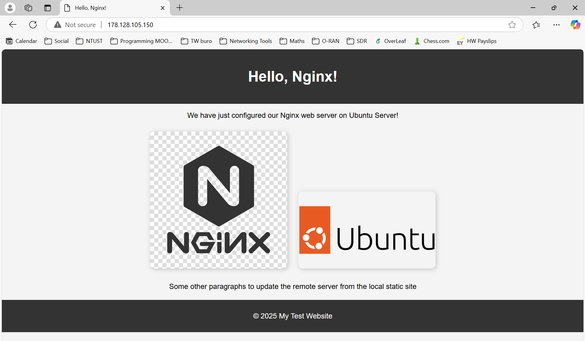

# Static Site Server

This project shows how to set up a basic web server using a basic static site served using Nginx. This is my implementation of [roadmap.sh](https://roadmap.sh/projects/static-site-server) project.

## Table of contents
- [Requirements](#requirements)
- [Usage](#usage)
- [Further insights](#dockerfile-insights)

## Requirements
You must have a Ubuntu/Debian system and server (yours or public cloud server), I used a [Digital Ocean Droplet](https://www.digitalocean.com/products/droplets) which at the time of writing this offers 200$ of free credit for the first two months after sign-up. The code also assumes that you have SSH connectivity to the server, if that is not the case you can refer to the following [directory](../ssh-remote-server-setup/).

## Usage
Start off by connecting via SSH to the server, then instal Nginx on it, do so according to the next code snippet:
```bash
sudo apt install nginx
```

Then you must copy the `restricted_cmds.sh` script to the executable local directory of your user in the remote server (`/usr/local/bin/`), and make it executable.

```bash
sudo chmod +x restricted_cmds.sh
```

You must as well edit the sudoers file in the remote server to allow the user to run some commands with sudo rights and not being prompted for the password. Execute the following bline:
```bash
sudo visudo
```

Now append the following line to the end of the file:
```bash
username ALL=(ALL) NOPASSWD: /usr/bin/rsync, \
                             /usr/local/bin/restricted_cmds, \
                             /usr/bin/systemctl restart nginx
Defaults!/usr/local/bin/restricted_cmds !requiretty
```

This allows the `rsync`, `systemctl restart nginx`, `chmod`* and `chown`* command to be run without being prompted for the password.

**`chmod` and `chown` commands can be executed with certain restrictions, this is further explained in the next section*

Then, assuming the repository is cloned on the client computer, you must install `rsync` on the client system. To do so, it is as simple as:
```bash
sudo apt install rsync
```

Now you should be able to synchronize the remote server with a local static site. This local static site is in the `/tutorial` directory, to deploy it in the remote server use `deploy.sh` script. First update the configuration variables according to your case, that is usually:
- `REMOTE_USER`: the user of the remote server.
- `REMOTE_HOST`: IP address of the remote server (it can as well be the domain if you have one pointed to your server).

Once the script is updated to your configuration, run the following:
```bash
bash deploy.sh
```

This should copy the static site directory from your computer to the remote server. Now just remains configuring the Nginx server, to do so create a configuration file for the static website according to the next code snippet:

```bash
nano /etc/nginx/sites-available/tutorial
```

Inside this file, you can paste the following configuration:
```nginx
server {
    listen 80;
    listen [::]:80;

    server_name _;  # you can change "_" for the domain name, in case you are using one

    root /srv/www/tutorial;
    index index.html;

    location / {
        try_files $uri $uri/ =404;
    }
}
```

If you check the server's IP address in your browser now you can check your website. Here is a screenshot of mine:



## Further insights on `deploy.sh` script
The server uses `/srv/www/` directory to serve the static websites using Nginx. The script first checks that these directories exist, if they do not it will create them.

Next it will run `rsync` command to synchronize all files from the local directory to the remote server.

Lastly, it updates ownership, permissions of the static website files and directories, and restart Nginx service to complete the deployment of the website in the remote server.

One of the trade-offs of this project is automation in a CI/CD scenario vs security. My proposal to speed up the deployment is to prompt the bare minimum for `sudo` password of the remote server to the user. To do so, I created a wrapper script that allows the user to execute `chmod` and `chown` without a password only in `/srv/www/` and its subdirectories. It is the best balance I could find between security and automation. Also, the sudoers file of the remote server is updated to run `rsync` and `systemctl restart nginx`.
